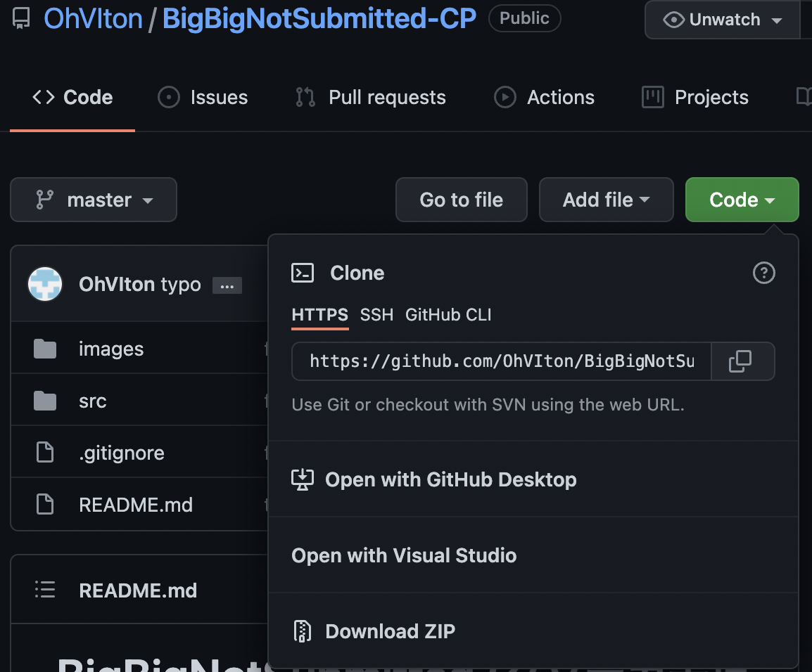
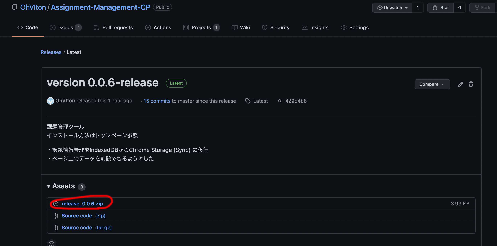
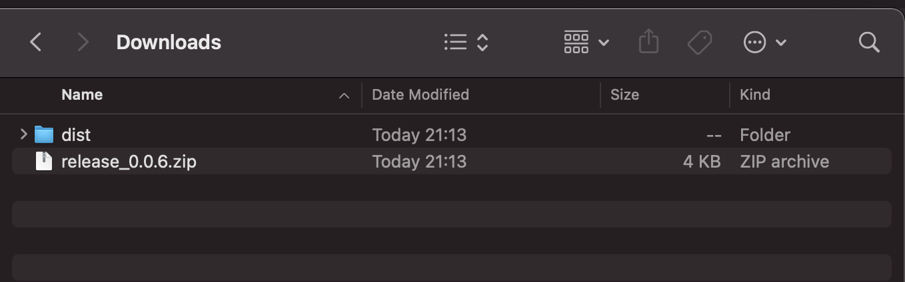
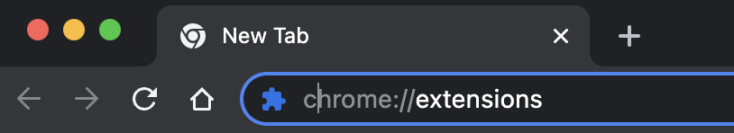
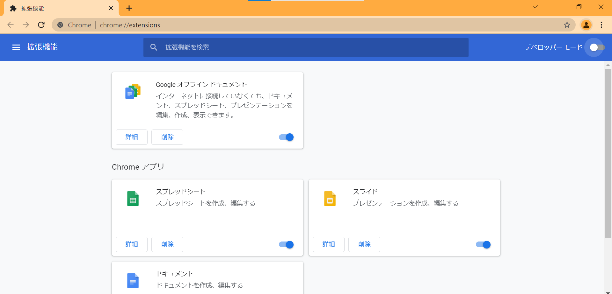
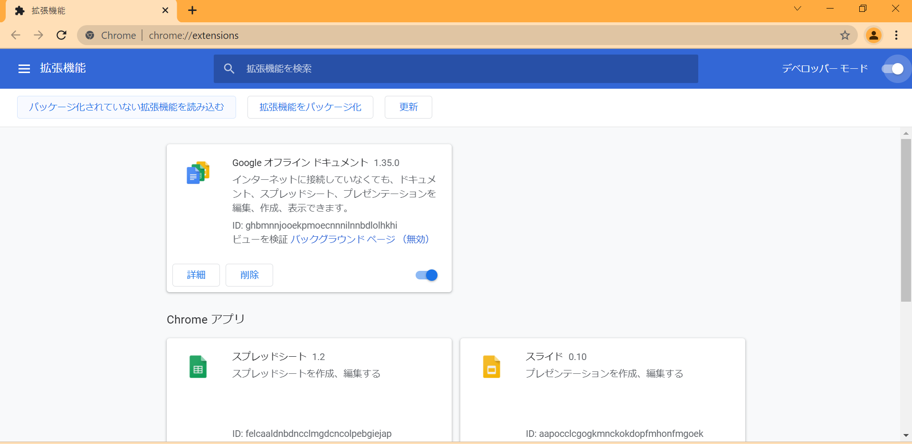
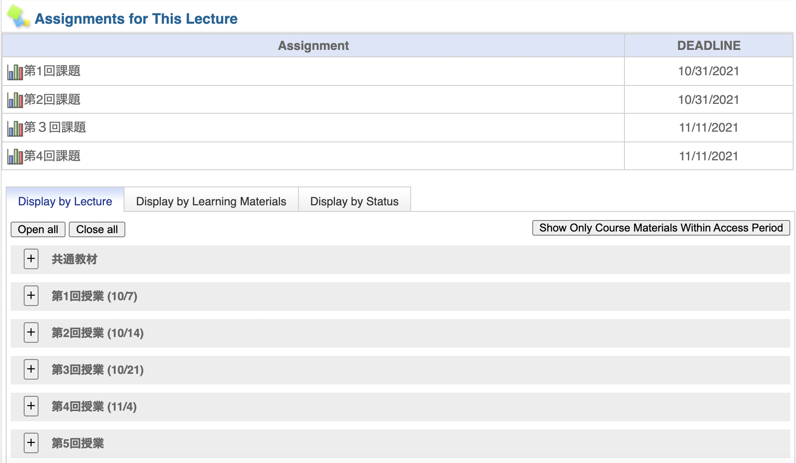
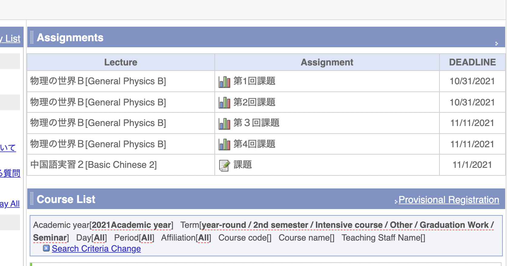
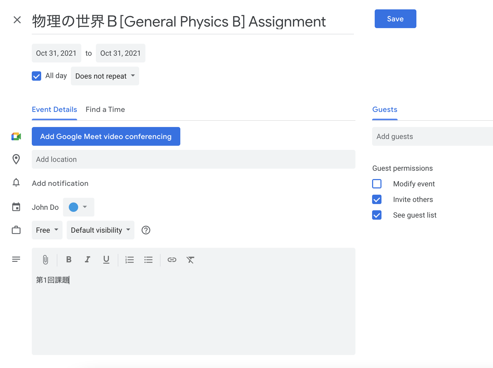

# Assignment-Management-CP

未提出（再提出）の課題をトップページで簡単に確認できるようにする Chrome用拡張機能です。 
  
DOM操作(データ取得)は講義ページに**手動でアクセスした時のみ**なので、サーバーに大きな負荷をかけることなく課題管理が可能です。  
  
クソデカ未提出とも共存可能です。  
  
## インストール方法
Releases→最新バージョンを選択して
  
ZIPファイルをダウンロードします
  
ダウンロードしたファイルを右クリック→すべて展開(Windows)か、ダブルクリックで展開(Mac)してください  
  
  
次に、Chromeを開き、アドレスバーに[chrome://extensions](chrome://extensions)と入力し、アクセスします。一番右にある３つ点が縦に並んだやつ→その他のツール→拡張機能でもいいです。 
  
以下の画面が開いたら、右上にあるデベロッパーモードをクリックして有効化してください  
  
そして、「パッケージ化されていない拡張機能を読み込む」をクリックして、

ダウンロードしたフォルダ内の**distフォルダ**を読み込みます  
これで完了。おめでとう。  

  
## 使用方法
講義ページを開くと、以下のように未提出または未回答の課題が表示されます。  
この時、課題の情報がブラウザ内に保存されます。

  
そして、そのデータベースの情報をもとに、LMSのトップページで課題一覧が表示されます。  
追加された情報はRemoveボタンを押すと削除できます。  
また、DEADLINEのリンクにアクセスすると、

以下のようにGoogle カレンダーへの追加もできます


## サーバー負荷について
DOM操作(データ取得)はあくまで**講義ページを手動で開いたときのみ**なので、サーバー負荷は一般の利用時と変わらないと推測されます。

## ビルド方法
以下を実行

```
npm i
npm run release
```
  
完成物はreleaseフォルダの中にできます

